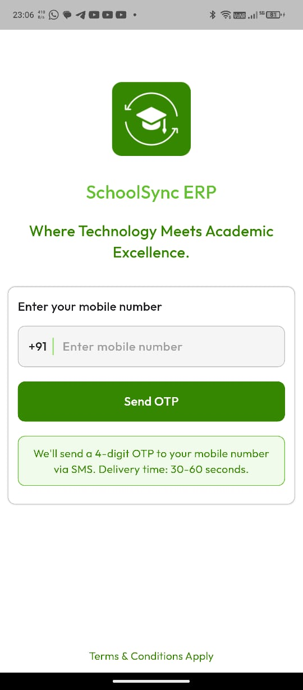
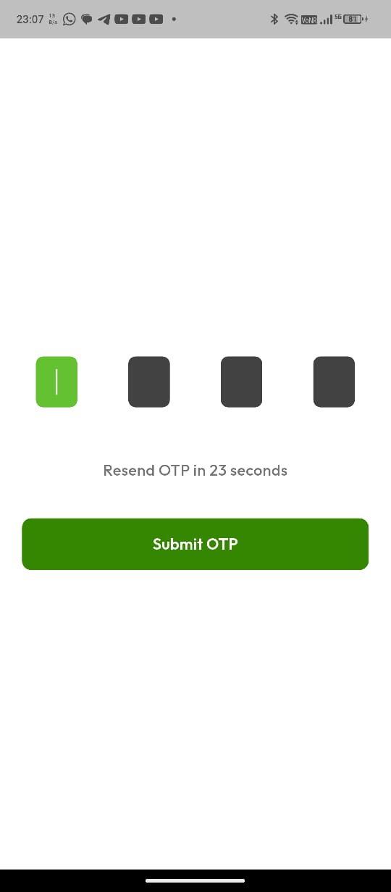
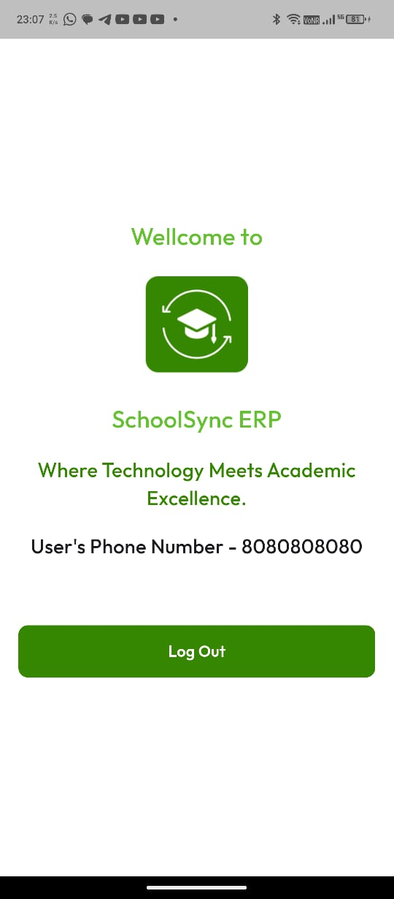

# Flutter OTP Authentication App

A Flutter mobile authentication app with OTP-based login, built using the provided Figma design and integrated with an SMS Backend API.

---

## 1. Setup Instructions

- Clone the repository:
  - `git clone https://github.com/PayalKmt/flutter_authentication_app.git`
  - `cd flutter_authentication_app`

- Install dependencies:
  - `flutter pub get`

---

## 2. How to Run the App

- Connect a device or emulator
- Run the app:
  - `flutter run`

**App Flow:**
- Enter mobile number  
- Request OTP  
- Enter OTP  
- Navigate to Home screen  
- JWT token stored for auto-login  
- Logout clears token  

---

## 3. Features Implemented

- Login screen with phone number validation  
- OTP verification screen with 4-digit input  
- Countdown timer for resend OTP  
- Verify OTP with API integration  
- Home screen showing user details  
- Logout option  
- Persistent authentication using SharedPreferences  
- Auto-login if token exists  
- UI following the Figma design  

---

## 4. Screenshots of the App

---
